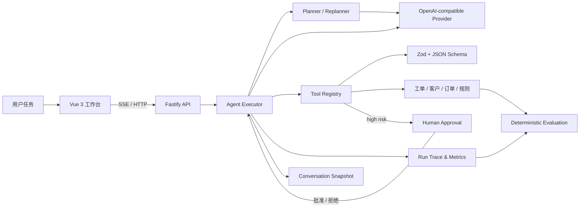
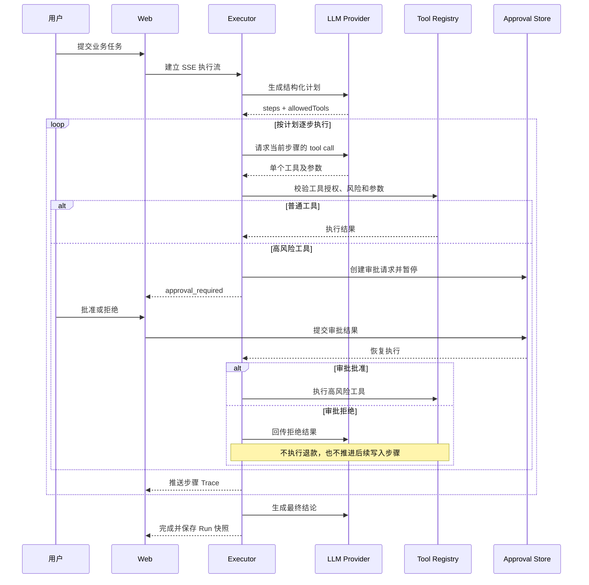

# AgentFlow 执行架构

## 模块关系

## 单次运行时序

## 核心约束

1. Planner 只提出计划，Executor 才拥有调度权。
2. 每个计划步骤只允许一项工具，模型不能调用未授权工具。
3. 所有工具参数必须通过服务端 Zod 校验，Prompt 不是安全边界。
4. 高风险工具批准前不产生业务写入，拒绝后不推进后续状态更新。
5. 工具成功后才推进计划游标，失败时只重规划尚未完成的步骤。
6. 评测复用真实 Executor 和 Tool Registry，同时检查回答、Trace 和最终业务状态。
