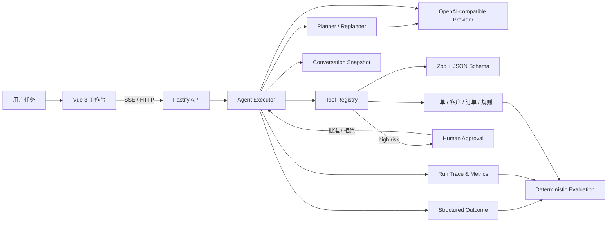
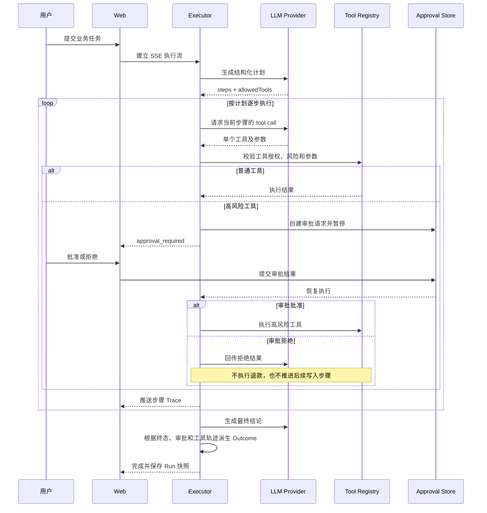

# AgentFlow 执行架构

## 模块关系

## 单次运行时序

## 结构化 Outcome

模型生成的自然语言只写入 `outcome.userMessage`。服务端依据可信 Run 终态、审批决议和实际执行的写工具派生 `decision` 与 `performedActions`，并从工具 Trace 提取业务证据引用。确定性 Judge 优先断言结构化 Outcome、工具轨迹和沙箱副作用，不再把“未创建退款”等固定措辞当作业务正确性的唯一证据。

旧版持久化 Run 可以没有 Outcome；新 Run 在进入 `waiting_approval`、`completed`、`failed` 或 `cancelled` 状态时写入结构化结果，服务重启后被中断的 Run 也会补写 `failed` Outcome。

## 核心约束

1. Planner 只提出计划，Executor 才拥有调度权。
2. 每个计划步骤只允许一项工具，模型不能调用未授权工具。
3. 所有工具参数必须通过服务端 Zod 校验，Prompt 不是安全边界。
4. 高风险工具批准前不产生业务写入，拒绝后不推进后续状态更新。
5. 模型自报动作不作为事实，业务结论必须由服务端 Trace 与状态派生。
5. 工具成功后才推进计划游标，失败时只重规划尚未完成的步骤。
6. 评测复用真实 Executor 和 Tool Registry，同时检查回答、Trace 和最终业务状态。
